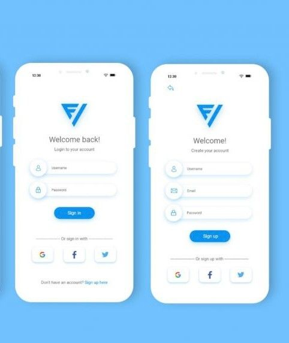

# Login/Sign Up App 🚪

## Summary

In order to provide user ability to login and signup to the apps, lets create a Login/Sign UP pages, where user

- login via username/password

- login via social media

- sign up via username/password / via social media

- logout from the app clicking logout button

## Dev Requirements

- save user info on BE or in window.locationStorage

## UX

- Can be different but be inspired by this image:

## Value Statement

The Login/SignUp allows a user to login/signup operations

## MVP Requirements

- a user can perform login via username/password.

- a user can perform login via social media

- a user can sign up via username/password / via social media

- a user should be able to logout from the app clicking logout button

## Future Requirements

- Show user information on Welcome Page
